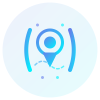

# 流浪地图 - 个人主页

<div align="center">



**流浪地图** - 用代码丈量世界，让技术不受边界

[](https://uniapp.dcloud.io/)
[](https://v3.vuejs.org/)
[](LICENSE)

🌐 **现代化个人主页** - 基于 Uniapp 打造的响应式个人展示平台

</div>

## ✨ 特性

- 🎨 **玻璃拟态设计** - 高端深色主题 + Glassmorphism 效果
- 📱 **完全响应式** - 手机、平板、桌面全适配
- 🔮 **霓虹渐变** - 紫蓝渐变配色，科技感十足
- ⚡ **流畅动画** - 60fps 丝滑过渡和微交互
- 🎯 **滚动监听** - Scroll Spy 导航自动高亮
- 🚀 **多端支持** - H5 / 微信小程序 / App 一套代码

## 🖼️ 预览

### Logo 设计

Logo 融合了「地图定位针」+「代码括号 {}」，象征着：
- 🗺️ 流浪地图 - 远程工作的自由灵活
- 💻 代码开发 - 15年技术老兵的专业实力
- ✈️ 全国可飞 - 短期驻场随时出发

## 📦 项目结构

```
2025-uniapp-personal-page/
├── pages/
│   └── index/
│       ├── index.vue                 # 主页（含 Scroll Spy 导航）
│       └── components/
│           ├── ServicesSection.vue   # 服务项目（6项）
│           ├── AdvantagesSection.vue # 服务优势（4项）
│           ├── CooperationSection.vue# 合作方式（4种）
│           └── ResumeSection.vue     # 关于我（简介/经历/技能/联系）
├── static/
│   ├── images/
│   │   ├── logo.svg                  # 主 Logo（200×200，带动画）
│   │   ├── logo-simple.svg           # 简化 Logo（100×100，导航栏用）
│   │   ├── logo-full.svg             # 完整 Logo（300×80，图标+文字）
│   │   └── logo-preview.html         # Logo 设计说明
│   ├── favicon-16.svg                # Favicon 16×16
│   ├── favicon-32.svg                # Favicon 32×32
│   └── favicon-generator.html        # Favicon 转换指南
├── utils/
│   ├── api.js                        # API 请求封装
│   ├── data.js                       # 数据管理（含 mock 数据）
│   ├── eventManager.js               # 事件总线
│   └── index.js                      # 工具统一导出
├── App.vue                           # 应用入口（全局样式）
├── main.js                           # 主入口文件
├── pages.json                        # 页面配置
└── manifest.json                     # 应用配置
```

## 🎯 功能模块

### 1. 玻璃拟态导航栏
- 📌 Sticky 吸顶导航
- 🎨 Logo + 品牌名「流浪地图」
- 🔗 四个锚点导航：服务项目 / 服务优势 / 合作方式 / 联系方式
- 📧 右上角邮箱（桌面端）
- ☰ 汉堡菜单（移动端）
- 🎯 **Scroll Spy**：滚动时导航自动高亮

### 2. 服务项目（6项）
- 💻 网站应用开发
- 📱 全端应用开发（Uniapp）
- 🔍 企业 SEO/GEO
- 💳 支付接入
- 🌐 WordPress 建站
- 🤖 AI 智能体接入

### 3. 服务优势（4项）
- 🏆 15年经验，靠谱交付
- ⚡ 响应快速，沟通直接
- 🛡️ 持续维护，长期可联
- ✈️ 远程高效，驻场可飞

### 4. 合作方式（4种）
- 📦 项目外包
- 🎯 技术咨询
- 💻 远程工作
- ✈️ 短期驻场

### 5. 关于我
- 📝 个人简介（单段完整描述）
- 💼 工作经历（时间线展示）
- 🛠️ 核心技能（PHP/MySQL/Redis/Uniapp/WordPress/AI）
- 📞 联系方式（邮箱/微信/工作模式/响应时间）

## 🚀 快速开始

### 安装依赖

```bash
npm install
```

### 开发模式

```bash
# H5
npm run dev:h5

# 微信小程序
npm run dev:mp-weixin
```

### 生产构建

```bash
# H5
npm run build:h5

# 微信小程序
npm run build:mp-weixin
```

## 🎨 设计系统

### 品牌配色

```css
/* 主渐变 */
--gradient-primary: linear-gradient(135deg, #667eea 0%, #00f2fe 100%);

/* 深色背景 */
--bg-dark-primary: #0a0a1e;
--bg-dark-secondary: #12122e;

/* 霓虹色 */
--neon-purple: #667eea;
--neon-blue: #00f2fe;
--neon-pink: #f093fb;
--neon-green: #43e97b;
```

### 响应式断点

```
手机：    < 768px   （默认）
平板：    768px - 1024px
小屏桌面：1024px - 1440px
大屏桌面：> 1440px
```

## 📝 自定义配置

### 修改个人信息

编辑 `utils/data.js` 中的 `defaultPersonalInfo`：

```javascript
this.defaultPersonalInfo = {
  name: '流浪地图',
  logo: '/static/images/logo-simple.svg',
  email: '79008887@qq.com',
  motto: '用代码丈量世界，让技术不受边界',
  copyright: 'Copyright © 2025 流浪地图 · 全国可飞',
  status: '当前可接单',
  tags: ['PHP全栈', '远程协作', 'WordPress', 'Uniapp', 'AI接入']
};
```

### 修改服务项目

编辑 `utils/data.js` 中的 `getServices()` 方法。

### 修改简介内容

编辑 `utils/data.js` 中的 `getResume()` 方法：

```javascript
profile: {
  summary: '专注PHP后端开发15年，从API对接到高性能系统架构...'
},
experience: [...],
coreSkills: [...],
contacts: [...]
```

### 配置 API 地址

编辑 `utils/index.js`：

```javascript
const api = new ApiRequest({
  baseURL: 'http://your-api-domain.com/api'
});
```

### 切换数据模式

在 `utils/data.js` 中：

```javascript
this.dummyMode = true;  // true: 使用 mock 数据，false: 调用真实 API
```

## 🔧 技术栈

- **框架**: Uniapp 3.0 + Vue 3
- **样式**: CSS Variables + Glassmorphism
- **动画**: CSS Animation + Intersection Observer
- **导航**: Scroll Spy + Smooth Scroll
- **构建**: HBuilderX / Vue CLI
- **Logo**: SVG 矢量图形

## 📱 平台支持

- ✅ H5（Web 浏览器）
- ✅ 微信小程序
- ✅ App（iOS/Android）
- ✅ 支付宝小程序
- ✅ 其他小程序平台

## 📁 Logo 文件说明

| 文件 | 尺寸 | 用途 |
|------|------|------|
| `logo.svg` | 200×200 | 首页大图、启动页、宣传物料 |
| `logo-simple.svg` | 100×100 | 导航栏、App 图标、小程序图标 |
| `logo-full.svg` | 300×80 | 页头横向展示、邮件签名、名片 |
| `favicon-32.svg` | 32×32 | 浏览器 Favicon |
| `favicon-16.svg` | 16×16 | 浏览器标签页图标 |

## 🔗 相关链接

- 📖 [Logo 设计预览](static/images/logo-preview.html)
- 🎨 [Favicon 生成指南](static/favicon-generator.html)

## 📄 License

[MIT](LICENSE)

---

<div align="center">

**用代码丈量世界，让技术不受边界**

Made with ❤️ by 流浪地图

</div>
